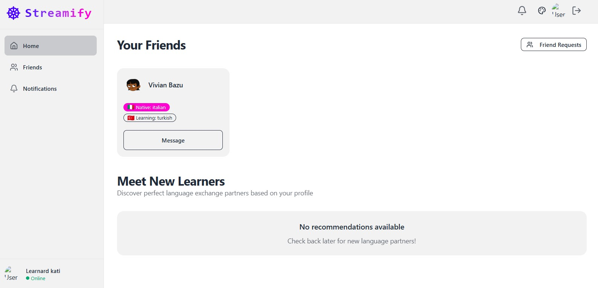
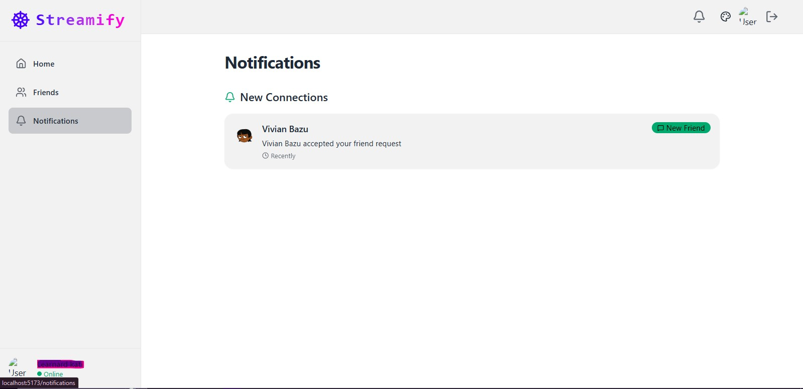
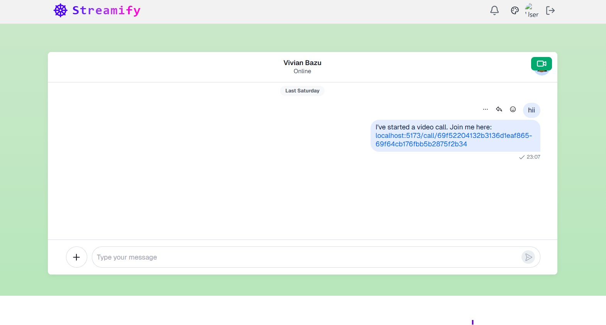

# 🚀 Streamify – Real-Time Language Exchange Platform.

A **full-stack real-time language exchange platform** designed to help users connect with people around the world to practice languages through messaging, social interaction, and live communication features.

---

## 🌍 Problem.

Many language learners struggle to:

* Find consistent conversation partners.
* Practice languages in real-world conversations.
* Build confidence speaking with native speakers.
* Access engaging platforms focused on language exchange.

Streamify solves this by creating a social and interactive environment where users can connect, communicate, and learn languages naturally in real time.

---

## ✨ Key Features.

* 🔐 **Secure Authentication** – User signup/login with personalized profiles.
* 👤 **Custom User Profiles** – Bio, languages, location, and avatars.
* 🤝 **Friend Request System** – Send, receive, and manage connections.
* 🎯 **Language-Based Recommendations** – Discover users based on language preferences.
* 💬 **Real-Time Messaging** – Instant one-on-one communication powered by Stream Chat.
* 📹 **Video Call Integration** – Share and join call links directly inside chats.
* 🖼️ **Dynamic Avatar Generation** – Automatically generated profile avatars.
* ⚡ **Fast Real-Time Experience** – Optimized frontend state management and caching.

---

## 📸 Screenshots.

### Sign In Page.


### Create Account Page.


### Dashboard.


### Notifications.


### Chat Page.


### Call Page.


---

## 👥 Demo Access

To allow full evaluation of the platform, please use the demo credentials below:

```txt
Email: demo@streamify.app
Password: demo1234

##  How to setup the project

# npm i

cd FRONTEND 

intialize the project
